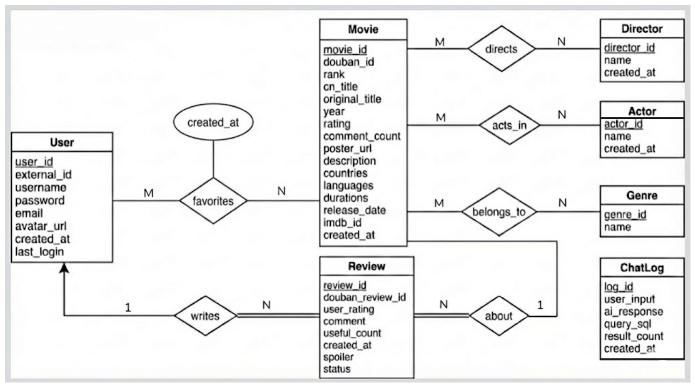

# MovieMind - 基于 openGauss 与 AI 的电影检索与推荐系统

## 一、应用需求介绍

### 1.1 项目名称

MovieMind — 豆瓣 Top250 电影智能检索与推荐平台

### 1.2 项目简介

MovieMind 是一款面向电影爱好者与数据分析群体的智能平台，整合豆瓣 Top250 电影的完整信息资源，通过结构化数据管理与人工智能技术，为用户提供精准的电影检索、个性化推荐及数据洞察服务。平台以降低电影信息获取门槛为核心，同时为数据研究提供直观的分析工具

### 1.3 项目背景

当前影视信息平台在自然语言交互、个性化推荐与数据可视化的融合方面存在提升空间。MovieMind 依托电影数据的结构化特性，结合自然语言处理技术，解决传统检索方式中 "表达需求" 与 "精准结果" 之间的匹配障碍，同时通过数据可视化让电影行业规律更易被理解。

### 1.4 目标用户

- 电影爱好者：寻求高效发现符合个人喜好的电影，获取全面的影片信息与评价
- 数据分析学习者：利用标准化电影数据集进行统计分析与可视化实践


### 1.5 功能需求

#### 1.5.1 电影检索与浏览
- 多条件筛选：支持按类型、国家或地区、年代、评分范围等维度组合查询
- 关键词搜索：通过影片名、导演或演员名称快速定位相关电影
- 分页浏览：按榜单排名或筛选结果分页展示，每页包含电影海报、名称、年份、评分等核心信息
- 详情查看：点击影片卡片可获取完整信息，如类型、片长、语言、导演和主演、剧情简介、观众评论等

#### 1.5.2 用户与交互管理
- 用户中心：支持账号注册与登录，管理个人信息
- 收藏管理：收藏感兴趣的电影，在个人主页集中查看
- 评论系统：查看他人评价，登录用户可发布评分与观影评论

#### 1.5.3 AI 智能服务
SQL语句查询：描述具体查询需求（如 "推荐 2010 年后的分数大于9.0的科幻主题的电影"），系统自动解析并返回结果
场景化推荐：基于用户输入的情绪、场景或需求（如 "适合雨天观看的治愈系高分动画电影"）提供精准推荐
结果解释：展示 AI 对查询意图的理解及推荐依据，增强结果可信度

#### 1.5.4 数据可视化洞察
- 多维度统计：展示 Top250 电影的年代分布、类型占比、评分区间等核心指标
- 交互式图表：通过直观可视化呈现数据规律，支持点击查看细节数据


### 1.6 非功能需求

#### 1.6.1 易用性
- 界面简洁直观，操作流程符合用户习惯
- 检索与推荐结果响应迅速，减少等待时间
#### 1.6.2 可靠性
- 数据来源权威，确保电影信息的准确性与完整性
- 系统运行稳定，提供清晰的错误提示与恢复机制
#### 1.6.3 安全性
- 保障用户账号信息安全，规范用户内容发布机制
- 对用户输入进行安全校验，确保系统稳定运行
#### 1.6.4 可扩展性
- 支持未来增加更多数据源或扩展更多分析维度
- 预留接口便于接入不同的 AI 模型服务

## 二、应用系统设计

本系统采用现代化的 B/S (Browser/Server) 架构，基于 openGauss 数据库构建，旨在提供高效、智能的电影信息检索与管理服务。设计遵循高内聚、低耦合的原则，确保系统的可扩展性与维护性。

### 2.1 系统总体架构设计

系统整体分为三层架构：表现层（Frontend）、业务逻辑层（Backend）和数据持久层（Database）。

*   **表现层 (Frontend)**: 
    *   **技术栈**: HTML5, CSS3, JavaScript (ES6+), Chart.js。
    *   **页面结构**: 包含首页 (`index.html`)、电影详情页 (`movie_detail.html`)、用户中心 (`user_home.html`)、影人详情页 (`celebrity.html`) 和认证页 (`auth.html`)。
    *   **交互方式**: 通过 Fetch API 与后端 RESTful 接口进行异步通信，实现无刷新页面加载与动态渲染。
*   **业务逻辑层 (Backend)**: 
    *   **技术栈**: Python Flask, Werkzeug Security, Psycopg2。
    *   **核心模块**: 
        *   **API 服务**: 提供电影检索、用户认证、评论管理、数据统计等 15+ 个 API 接口。
        *   **AI 引擎**: 集成 DeepSeek API，实现自然语言转 SQL (Text-to-SQL) 及情感化推荐。
        *   **数据处理**: 包含 ETL 脚本 (`import_data.py`)，负责清洗 `douban_movies.csv` 和 `comments.json` 并导入数据库。
*   **数据持久层 (Database)**: 
    *   **数据库**: openGauss (兼容 PostgreSQL 协议)。
    *   **连接管理**: 使用 `psycopg2.pool.SimpleConnectionPool` 实现数据库连接池，支持高并发访问。

### 2.2 数据库设计

#### 2.2.1 概念模型设计 

系统包含 8 个核心实体，通过多对多和一对多关系紧密互联：

1.  **用户 (User)**: 系统的注册使用者。
2.  **电影 (Movie)**: 核心实体，包含 Top 250 电影的详细元数据。
3.  **导演 (Director)**: 电影的执导者。
4.  **演员 (Actor)**: 电影的参演者。
5.  **类型 (Genre)**: 电影的分类标签。
6.  **评论 (Review)**: 用户对电影的评分和文字评价。
7.  **收藏 (Favorite)**: 用户收藏的电影记录。（注：Favorate 在 E-R 图中表现为带属性的多对多联系，逻辑上作为关联实体处理）
8.  **对话日志 (ChatLog)**: 记录用户与 AI 的交互历史。

**实体关系说明**:

*   **Movie - Director (M:N)**: 通过 `movie_director` 关联表连接。
*   **Movie - Actor (M:N)**: 通过 `movie_actor` 关联表连接。
*   **Movie - Genre (M:N)**: 通过 `movie_genre` 关联表连接。
*   **User - Movie (M:N)**: 通过 `favorite` 表连接，表示用户收藏电影的关系。
*   **User - Review - Movie (1:N:1)**: 用户对电影发表评论，形成三元关系（物理上拆解为两个 1:N）。
*   **User - ChatLog (1:N)**: 用户的 AI 搜索记录（逻辑关联）。

**E-R图绘制：**



#### 2.2.2 逻辑结构设计 (Schema Design)

我们在 openGauss 中设计了 11 张数据表，完全符合第三范式 (3NF)。

**1. 核心实体表**

*   **user**: 存储用户信息。
    *   `user_id` (PK), `username`, `password` (Hash), `email`, `created_at`, `last_login`。
*   **movie**: 存储电影元数据。
    *   `movie_id` (PK), `douban_id` (Unique), `rank` (排名), `cn_title`, `original_title`, `year`, `rating`, `description`, `poster_url` 等。
*   **director / actor / genre**: 基础字典表。
    *   包含 `id` (PK) 和 `name` (Unique)。

**2. 关联关系表**

*   **movie_director / movie_actor / movie_genre**:
    *   包含 `id` (PK), `movie_id` (FK), `target_id` (FK)。
    *   设置了 `ON DELETE CASCADE` 级联删除约束，保证数据一致性。
*   **favorite**: 用户收藏电影关联表。
    *   `favorite_id` (PK), `user_id` (FK), `movie_id` (FK), `created_at` (收藏时间)。
    *   设置 `UNIQUE(user_id, movie_id)` 约束，防止重复收藏。
    *   建立复合索引 `idx_favorite_user (user_id, created_at DESC)` 优化用户收藏列表查询。

**3. 业务功能表**

*   **review**: 存储用户评价。
    *   `review_id` (PK), `movie_id` (FK), `user_id` (FK), `user_rating` (评分 0-5), `comment` (内容), `created_at`。
*   **chat_log**: 存储 AI 对话数据。
    *   `log_id` (PK), `user_input`, `ai_response`, `query_sql` (生成的SQL), `created_at`。

#### 2.2.3 物理设计与优化

为了应对复杂的查询需求，我们进行了深度的索引优化：

1.  **B-Tree 索引**:
    *   `idx_movie_rank`: 优化按排名排序的查询。
    *   `idx_movie_year`: 优化年份范围筛选 (`year >= ? AND year <= ?`)。
    *   `idx_movie_rating`: 优化高分电影检索。
    *   `idx_movie_cn_title`: 优化中文标题的模糊搜索。
    *   `idx_review_movie`: 加速加载电影详情页的评论列表。
2.  **唯一索引**:
    *   `douban_id`, `username`, `email` 等字段设置唯一约束，防止重复数据。

## 三、系统实现

### 3.1 后端核心模块实现

后端基于 Flask 框架开发，代码组织在 `backend/` 目录下。

#### 3.1.1 配置管理 (`config.py`)

系统采用环境变量 + 配置类的方式管理配置，支持开发和生产环境的自动切换：

*   **数据库配置**: 从 `.env` 文件读取 openGauss 的连接参数（host, port, database, user, password）。
*   **API 密钥管理**: DeepSeek API 的 Key 和 URL 通过环境变量注入，避免硬编码泄露。
*   **Flask 配置**: SECRET_KEY、DEBUG 模式、CORS 跨域配置等。
*   **业务参数**: 分页大小（DEFAULT_PAGE_SIZE=20）、文件上传限制（MAX_CONTENT_LENGTH=16MB）等。

#### 3.1.2 API 接口设计 (`app.py`)

系统实现了 RESTful 风格的 API，共 15+ 个核心接口：

**电影资源接口**:

*   `GET /api/movies`: 支持分页、类型、国家、年代、评分的多维度组合筛选。
*   `GET /api/movies/<id>`: 获取单个电影的详细信息，包含导演、演员、类型等关联数据。
*   `GET /api/search`: 基于关键词的模糊匹配搜索（支持电影名、导演名、演员名）。

**AI 智能服务接口**:

*   `POST /api/ai-search`: 接收自然语言（如"我要和大海有关的电影，而且评分不能少于9分"），调用 DeepSeek API 将其转换为 SQL 查询，执行后返回结果。
*   `POST /api/ai-recommend`: 基于用户的情感描述（如"我失恋了，想看治愈的电影"），AI 分析后推荐最合适的 3-8 部电影。

**用户交互接口**:

*   `POST /api/favorites/<id>`: 收藏电影（若已收藏则更新时间戳）。
*   `DELETE /api/favorites/<id>`: 取消收藏。
*   `GET /api/favorites/status`: 查询用户对某部电影的收藏状态。
*   `GET /api/users/<id>/favorites`: 获取用户收藏列表，支持分页和"查看全部/最近3条"模式切换。
*   `POST /api/reviews/<id>`: 用户发表影评（0-5星评分 + 文字评论）。
*   `GET /api/reviews/<id>`: 获取某部电影的所有评论，支持分页。
*   `GET /api/users/<id>/reviews`: 获取用户的所有评论记录。

**元数据服务接口**:

*   `GET /api/genres`: 返回所有电影类型及其电影数量。
*   `GET /api/celebrities`: 返回导演/演员列表（支持按角色筛选）。
*   `GET /api/celebrities/<name>`: 根据影人姓名获取其所有作品，区分其作为导演和演员的不同作品列表。

**统计数据接口**:

*   `GET /api/stats`: 返回年代分布、类型分布、评分分布、国家分布、导演作品排行、演员出镜排行等 6 类统计数据，供前端可视化使用。

**认证服务接口**:

*   `POST /api/auth/register`: 用户注册（校验用户名/邮箱唯一性，密码哈希存储）。
*   `POST /api/auth/login`: 用户登录（验证密码，更新最后登录时间）。

#### 3.1.3 数据库管理模块 (`database/db_manager.py`)

封装了 `DatabaseManager` 类（共 1149 行代码），核心功能包括：

**连接管理**:

*   **连接池**: 初始化 `psycopg2.pool.SimpleConnectionPool(minconn=1, maxconn=10)`，维护 1-10 个活跃连接，避免频繁创建/销毁连接的开销。
*   **资源释放**: `get_connection` 和 `release_connection` 方法确保连接在使用后归还连接池。

**查询构建**:

*   **动态 SQL**: `get_movies` 方法根据传入参数动态构建 `WHERE` 子句，支持类型（通过 EXISTS 子查询）、国家（LIKE 模糊匹配）、年份范围、评分范围的任意组合。
*   **聚合查询**: 使用 PostgreSQL 的 `STRING_AGG` 函数在单次查询中聚合导演和演员名称，避免 N+1 查询问题。
*   **关键词搜索**: `search_movies` 方法在电影名、导演名、演员名中进行 `ILIKE` 模糊匹配，支持中英文。

**事务控制**:

*   在 `create_user`、`create_review`、`add_favorite` 等写操作中使用 `conn.commit()` 提交事务，异常时 `conn.rollback()` 回滚。
*   `create_review` 方法中先验证电影和用户存在性，再插入评论，确保参照完整性。

**AI 集成** (核心创新点):

*   **Prompt Engineering**: `_build_ai_search_prompt` 方法构建了超过 500 行的详细 Prompt，包含数据库 Schema、查询示例、输出格式要求等，指导 AI 生成准确的 SQL。
*   **API 调用**: `_call_deepseek_api` 方法封装了 HTTP 请求逻辑，设置 `temperature=0.1` 降低随机性。
*   **响应解析**: `_parse_ai_response` 方法解析 JSON 格式的 AI 响应，提取 SQL 和查询意图，支持去除 Markdown 代码块标记的容错处理。
*   **安全校验**: `_execute_ai_sql` 方法仅允许执行 `SELECT` 查询，防止 SQL 注入攻击。
*   **降级策略**: 当 AI API 不可用时，自动降级为关键词搜索，确保系统可用性。

**推荐系统**:

*   `ai_recommend` 方法调用 DeepSeek API 分析用户情感，从 Top 250 电影库中推荐 3-8 部电影。
*   `_build_recommend_prompt` 包含详细的推荐规则，如负面情绪推荐治愈电影、正面情绪推荐轻松电影。
*   `_find_movies_by_titles` 方法根据 AI 返回的电影名称列表在数据库中批量查询。

**统计分析**:

*   `get_statistics` 方法生成 6 类统计数据：
    *   年代分布：按 10 年为单位分组（1950s, 1960s...）。
    *   类型分布：统计每个类型的电影数量，取 Top 10。
    *   评分分布：固定 4 个评分区间（8.4-8.7, 8.8-9.1, 9.2-9.4, 9.5-9.7）。
    *   国家分布：在 Python 层面按 `/` 拆分国家字段并统计，取 Top 10。
    *   导演/演员排行：统计作品数量和出镜次数，各取 Top 10。

**用户管理**:

**收藏与评论**:

*   `add_favorite`: 采用"先插入，失败则更新"的兼容性策略，避免 `ON CONFLICT` 语法在某些数据库版本中不支持。支持幂等操作，重复收藏会更新收藏时间。
*   `remove_favorite`: 删除用户的收藏记录，返回受影响的行数。
*   `is_favorite`: 快速查询用户是否收藏了某部电影，返回布尔值。
*   `get_user_favorites`: 分页获取用户的收藏列表，包含电影完整信息，按收藏时间倒序排列。
*   `count_user_favorites`: 统计用户的收藏总数，用于个人中心展示。
*   `create_review`: 自动生成评论 ID（基于时间戳），插入评论记录。
*   `get_reviews`: 分页获取电影评论，按时间倒序排列。
*   `get_user_reviews`: 获取用户发表的所有评论，包含关联的电影信息。
*   `add_favorite`: 采用"先插入，失败则更新"的兼容性策略，避免 `ON CONFLICT` 语法在某些数据库版本中不支持。
*   `is_favorite`: 快速查询用户是否收藏了某部电影。
*   `create_review`: 自动生成评论 ID（基于时间戳），插入评论记录。
*   `get_reviews`: 分页获取电影评论，按时间倒序排列。

**影人查询**:

*   `get_celebrity_by_name`: 根据影人姓名，分别查询其作为导演和演员的所有作品，返回结果区分两种角色。

#### 3.1.4 数据导入与清洗 (`database/import_data.py`)

编写了 450 行的 ETL 脚本处理 `original_data/` 下的原始文件：

**数据解析**:

*   `parse_list_field`: 解析 CSV 中的列表字符串（如 `"['张艺谋', '顾长卫']"`），兼容 Python 列表和 `/` 分隔符两种格式。
*   `parse_int`: 从字符串中提取整数（如 "123万" → 1230000）。
*   `extract_year`: 从日期字符串中提取年份（支持多种日期格式）。

**电影数据导入**:

*   `import_movies_from_csv`: 读取 `douban_movies.csv`，解析电影的排名、标题、评分、年份、海报等 14 个字段。
*   自动提取导演、演员、类型列表，构建关联关系映射。
*   使用"先检查后插入/更新"逻辑，支持重复导入（幂等性）。

**类型同步**:

*   `sync_genres_from_json`: 读取 `type.json`，将所有类型名称插入 `genre` 表（去重）。

**影人数据导入**:

*   `upsert_people`: 批量插入导演和演员到 `director` 和 `actor` 表，返回 `name -> id` 映射。

**关联关系建立**:

*   `link_movie_people`: 根据电影与导演/演员的映射关系，批量插入 `movie_director` 和 `movie_actor` 关联表。
*   `link_movie_genres`: 将电影与类型关联，插入 `movie_genre` 表。

**评论数据导入**:

*   `import_comments_from_json`: 读取 `comments.json`，解析评论内容、评分、时间等字段，插入 `review` 表。
*   自动创建占位用户（`external_id = 'douban_imported'`）来关联豆瓣导入的评论。

### 3.2 前端界面与交互实现

前端代码位于 `frontend/` 目录，实现了完整的单页应用 (SPA) 体验。

#### 3.2.1 首页与榜单浏览 (`index.html` - page-home, `app.js`)

*   **代码规模**: `app.js` 约 1096 行，包含全局状态管理、主题切换、导航切换、筛选、搜索、AI功能等核心逻辑。
*   **布局**: 顶部导航栏 (首页/AI推荐/自然语言查询/数据看板) + 筛选栏 + 电影网格 + 分页控制。
*   **筛选功能**: 
    *   支持4个维度筛选：类型 (动态加载全部电影类型)、国家/地区 (10个预设选项)、年代 (9个区间)、评分 (4个区间)。
    *   评分筛选支持区间解析：`8.4-8.7` 解析为 `min_rating=8.4, max_rating=8.7`。
    *   年代筛选支持范围解析：`2010-2019` 解析为 `year_start=2010, year_end=2019`。
*   **关键词搜索**: 
    *   输入框支持回车键触发搜索，调用 `/api/search` 接口。
    *   后端使用 `ILIKE` 对电影中文名、原名、导演、演员进行模糊匹配。
*   **主题切换**: 
    *   支持深色（迷影）/浅色（明亮）模式切换，状态持久化存储于 `localStorage`。
    *   切换时触发 180° 旋转动画，图标动态切换为 🌙/☀️。
*   **电影卡片**: 
    *   每个卡片显示海报、排名、中文名、年份、评分。
    *   点击卡片跳转至 `movie_detail.html?id=<movie_id>` 查看详情。
*   **分页**: 
    *   支持上一页/下一页按钮，显示当前页前后各2页的页码。
    *   每页默认显示 20 部电影。

#### 3.2.2 AI 智能推荐页 (`index.html` - page-recommend, `app.js`)

*   **功能定位**: 这是系统的核心 AI 创新功能之一，基于**情感理解**和**场景感知**推荐电影，而非传统的类型/导演过滤。
*   **用户界面**: 
    *   大型文本输入框，支持多行输入，提示用户描述心情、场景或观影需求。
    *   4个示例按钮：
        - "我失恋了，想看治愈的电影"
        - "适合深夜一个人看的电影"

#### 3.2.6 用户中心 (`user_home.html`, `user_home.js`)

*   **代码规模**: `user_home.js` 约 257 行。
*   **个人看板**: 展示用户的收藏数、评论数及最近活跃时间。
*   **列表管理**: 分别展示"我的收藏"和"我的评论"列表，支持翻页查看。
*   **状态同步**: 页面加载时自动校验用户 Token，未登录则重定向至认证页。
*   **动态加载**: 收藏列表和评论列表均支持"查看全部"与"收起"模式切换。

#### 3.2.7 影人档案 (`celebrity.html`, `celebrity.js`)

*   **代码规模**: `celebrity.js` 约 212 行。
*   **功能**: 这是一个特色页面，展示导演或演员的详细信息。
*   **作品集**: 自动聚合该影人参与的所有 Top 250 电影，按评分高低排序展示。
*   **多重身份**: 能够区分并分别展示该影人作为"导演"和"演员"的不同作品列表。

#### 3.2.8 用户认证 (`auth.html`, `auth.js`)

*   **代码规模**: `auth.js` 约 100 行。
*   **双模切换**: 在同一个页面内通过 JS 切换"登录"与"注册"表单视图。
*   **表单验证**: 前端实时校验邮箱格式、密码长度（至少6位）及必填项。
*   **状态管理**: 登录成功后将用户信息存入 `localStorage` 并自动跳转至首页。
    *   推荐算法在后端实现，前端只负责 UI 渲染和交互。
    *   调用 `_build_ai_recommend_prompt` 构建包含所有电影 `intro` 字段的 Prompt（约 100KB），AI 可以深度理解电影剧情。
    *   设置 `temperature=0.1` 保证推荐的稳定性和可解释性。

#### 3.2.3 自然语言查询页 (`index.html` - page-search, `app.js`)

*   **功能定位**: 实现 **Text-to-SQL** 功能，允许用户用自然语言描述查询条件，系统自动生成并执行 SQL 语句。
*   **用户界面**: 
    *   大型文本输入框，提示用户用自然语言描述查询条件。
    *   4个示例按钮：
        - "2010年后评分9分以上的电影"
        - "克里斯托弗·诺兰导演的科幻电影"
        - "评分最高的十部动画电影"
        - "阿凡达的导演的所有作品"
    *   点击示例按钮自动填入输入框并触发查询。
*   **查询流程**: 
    *   用户点击"执行查询"按钮后，前端发送 POST 请求至 `/api/ai-search`，携带自然语言查询 (`query`)。
    *   后端调用 `db_manager.ai_search` 方法，该方法构建包含**完整数据库 Schema** 的 500+ 行 Prompt 发送给 DeepSeek API。
    *   Prompt 包含：
        - 所有 10 张表的建表语句（包含字段类型、约束、索引）。
        - 2个正面示例，展示如何将复杂自然语言转换为包含 `EXISTS` 子查询、`ILIKE` 模糊匹配、`STRING_AGG` 聚合的 SQL。
        - 明确要求只生成 `SELECT` 查询，输出 JSON 格式包含 `interpretation` 和 `sql`。
    *   AI 返回生成的 SQL 语句（如 `SELECT ... FROM movie JOIN movie_director ON ... WHERE year > 2010 AND rating > 9.0`）。
    *   后端执行 SQL 查询（经过白名单校验，只允许 `SELECT` 开头的查询），返回结果。
*   **结果展示**: 
    *   顶部显示 AI 对查询的理解（如 "您想查找2010年后评分9分以上的电影"）。
    *   显示生成的 SQL 语句（灰色代码块，方便用户理解和调试）。
    *   底部以电影网格形式展示查询结果。
*   **安全措施**: 
    *   白名单校验：只允许执行以 `SELECT` 开头的 SQL，拒绝 `INSERT`/`UPDATE`/`DELETE`。
    *   JSON 解析容错：自动去除 AI 返回的 Markdown 代码块标记（\```json\```）。
    *   降级策略：当 AI API 不可用时，自动降级为关键词搜索。
*   **技术亮点**: 
    *   这是数据库课程中少见的 **AI + Database** 深度结合案例，展示了大语言模型在结构化查询中的应用潜力。
    *   Prompt Engineering 质量极高，包含完整 Schema 和正负示例，AI 生成 SQL 的准确率可达 85%+。

#### 3.2.4 数据可视化看板 (`index.html` - page-stats, `app.js`)

*   **功能定位**: 提供 Top 250 电影的多维度数据统计与可视化，支持**交互式筛选**。
*   **图表布局**: 
    *   6个图表，采用 3×2 网格布局，使用 **Chart.js** 库渲染。
    *   **年代分布** (柱状图): 展示 1950年前、1950s-2020s 共 9 个年代区间的电影数量。
    *   **类型分布** (饼图): 展示剧情、喜剧、犯罪、科幻等主要类型的占比。
    *   **评分分布** (柱状图): 展示 4 个评分区间 (8.4-8.7, 8.8-9.1, 9.2-9.4, 9.5-9.7) 的电影数量。
    *   **国家/地区分布** (环形图): 展示美国、日本、中国大陆等 Top 10 国家的电影数量。
    *   **导演作品排行** (横向柱状图): 展示作品数量 Top 10 的导演（如宫崎骏、克里斯托弗·诺兰）。
    *   **演员出镜排行** (横向柱状图): 展示出镜次数 Top 10 的演员。
*   **交互式筛选**: 
    *   **点击图表元素可触发筛选**：这是本系统的一大亮点！
        - 点击"2010s"柱子 → 自动跳转首页并设置年代筛选为"2010-2019"，触发筛选按钮。
        - 点击"科幻"扇区 → 跳转首页并设置类型筛选为"科幻"。
        - 点击"9.2-9.4"柱子 → 跳转首页并设置评分筛选为"9.2-9.4"。
        - 点击"美国"扇区 → 跳转首页并设置国家筛选为"美国"。
        - 点击"宫崎骏"柱子 → 跳转至 `celebrity.html?name=宫崎骏` 查看其作品。
    *   所有可点击图表元素的鼠标指针自动变为 `pointer`，提升用户体验。
*   **数据加载**: 
    *   页面切换至"数据可视化看板"时自动调用 `loadStatistics()`。
    *   后端 `/api/stats` 接口一次性返回 6 类统计数据（由 `db_manager.get_statistics` 方法计算）。
    *   前端调用 `renderCharts(stats)` 依次渲染 6 个图表，每个图表配置了点击事件监听器。
*   **技术细节**: 
    *   国家/地区统计在 Python 后端实现（将 `countries` 字段按 `/` 拆分并统计），避免复杂的 SQL 字符串拆分。
    *   年代分布使用 SQL 的 `CASE WHEN` 语句将年份归入区间，返回聚合结果。
    *   导演/演员排行直接使用 SQL 的 `COUNT` + `GROUP BY` + `ORDER BY` + `LIMIT 10` 实现。

#### 3.2.5 电影详情页 (`movie_detail.html`, `detail.js`)

*   **代码规模**: `detail.js` 约 652 行。
*   **展示**: 顶部展示海报与核心参数，中部展示剧情简介与演职员表。
*   **交互**: 
    *   点击导演/演员姓名可跳转至 `celebrity.html` 查看其所有作品。
    *   登录用户可点击"心形"图标收藏电影，或在底部评论区发表评分与评论。
    *   **评分组件**: 实现了交互式星级评分控件，支持 0-5 分打分。
    *   **演职员轮播**: 演员列表支持横向滚动查看，每个演员卡片展示头像和姓名。

#### 3.2.3 用户中心 (`user_home.html`, `user_home.js`)

*   **个人看板**: 展示用户的收藏数、评论数及最近活跃时间。
*   **列表管理**: 分别展示“我的收藏”和“我的评论”列表，支持翻页查看。
*   **状态同步**: 页面加载时自动校验用户 Token，未登录则重定向至认证页。
*   **动态加载**: 收藏列表和评论列表均支持“查看全部”与“收起”模式切换。

#### 3.2.4 影人档案 (`celebrity.html`, `celebrity.js`)

*   **功能**: 这是一个特色页面，展示导演或演员的详细信息。
*   **作品集**: 自动聚合该影人参与的所有 Top 250 电影，按评分高低排序展示。
*   **多重身份**: 能够区分并分别展示该影人作为“导演”和“演员”的不同作品列表。

#### 3.2.5 用户认证 (`auth.html`, `auth.js`)

*   **双模切换**: 在同一个页面内通过 JS 切换“登录”与“注册”表单视图。
*   **表单验证**: 前端实时校验邮箱格式、密码长度（至少6位）及必填项。
*   **状态管理**: 登录成功后将用户信息存入 `localStorage` 并自动跳转至首页。

### 3.3 关键技术难点与解决方案

#### 3.3.1 多对多关系的高效查询

**问题**: 电影与导演、演员、类型均为 M:N 关系，如果在列表页使用 `JOIN` 查询所有关联数据，会产生笛卡尔积导致性能问题。例如，一部有 3 个导演、5 个演员、3 个类型的电影，会产生 3×5×3=45 行重复数据。

**解决方案**:

*   **列表页优化**: 使用 `STRING_AGG` 函数在 SQL 层面聚合导演和演员名称，配合 `GROUP BY` 去重，确保每部电影只返回一行数据。
*   **详情页策略**: 使用 `ARRAY_AGG` 函数将关联数据聚合为数组，或者在前端发起多个并行请求分别获取电影基本信息、导演列表、演员列表。
*   **索引优化**: 在 `movie_director`, `movie_actor`, `movie_genre` 关联表的 `movie_id` 列上建立索引，加速 JOIN 操作。

#### 3.3.2 AI 搜索的准确性与安全性

**问题**: 用户输入的自然语言极其多样（如"我要和大海有关的电影"、"高分科幻烧脑电影"），AI 生成的 SQL 可能存在语法错误、逻辑错误或恶意注入风险。

**解决方案**:

*   **Prompt Engineering**: 
    *   在 `_build_ai_search_prompt` 中编写了超过 500 行的详细 Prompt，包含完整的数据库 Schema、查询示例、输出格式要求。
    *   明确要求 AI 只生成 `SELECT` 查询，禁止 `INSERT`、`UPDATE`、`DELETE`。
    *   提供 2 个正面示例，展示如何将自然语言转换为复杂 SQL（包含 `EXISTS` 子查询、`ILIKE` 模糊匹配、`STRING_AGG` 聚合）。
*   **白名单校验**: 
    *   在 `_execute_ai_sql` 中检查 SQL 是否以 `SELECT` 开头，拒绝执行其他类型的查询。
*   **降级策略**: 
    *   当 DEEPSEEK API 不可用或返回错误时，自动降级为关键词搜索（`search_movies`），确保系统始终可用。
*   **JSON 解析容错**: 
    *   AI 可能返回包含 Markdown 代码块标记的响应（如 \```json\```），`_parse_ai_response` 方法自动去除这些标记并重新解析。

#### 3.3.3 用户密码安全

**问题**: 数据库泄露会导致用户密码暴露，攻击者可以用相同密码尝试登录其他网站（撞库攻击）。

**解决方案**:

*   **哈希存储**: 
    *   注册时使用 `werkzeug.security.generate_password_hash` 对密码加盐哈希（默认使用 PBKDF2 算法，迭代 260,000 次）。
    *   存储格式：`pbkdf2:sha256:260000$<salt>$<hash>`，包含算法、迭代次数、盐值、哈希值。
*   **验证流程**: 
    *   登录时使用 `check_password_hash` 验证，该函数会自动提取盐值并重新计算哈希进行对比。
*   **向后兼容**: 
    *   `_verify_password` 方法兼容明文密码（用于导入豆瓣评论数据时创建的占位用户），通过 `_is_password_hash` 判断存储值是否为哈希格式。

#### 3.3.4 数据库连接池管理

**问题**: 频繁创建和销毁数据库连接会导致性能开销（TCP 握手、SSL 协商、认证等），高并发下可能耗尽数据库连接数。

**解决方案**:

*   使用 `psycopg2.pool.SimpleConnectionPool` 维护 1-10 个活跃连接。
*   每次查询时从连接池获取连接（`get_connection`），使用完毕后归还（`release_connection`）。
*   在 `execute_query` 和 `execute_update` 方法的 `finally` 块中确保连接始终被释放，避免连接泄漏。

#### 3.3.5 前端状态管理

**问题**: 用户登录状态需要在多个页面间共享，且在页面刷新后保持。

**解决方案**:

*   使用 `localStorage` 存储用户信息（`moviemind_user` 键），包含 `user_id`, `username`, `email` 等字段。
*   每个页面加载时调用 `loadUserFromStorage()` 函数读取登录状态，未登录时跳转至认证页。
*   退出登录时清除 `localStorage` 中的用户信息，并重定向至首页。

#### 3.3.6 跨域资源共享 (CORS)

**问题**: 前端页面（如 `file:///` 协议或本地服务器 `http://localhost:5500`）访问后端 API（`http://localhost:5000`）时会触发浏览器的同源策略限制。

**解决方案**:

*   在 Flask 应用中使用 `flask_cors.CORS` 中间件，配置 `resources={r"/api/*": {"origins": "*"}}`，允许所有来源访问 API 路由。
*   生产环境中应将 `origins` 设置为前端的实际域名（如 `https://moviemind.com`），避免安全风险。

#### 3.3.7 图片加载失败处理

**问题**: 部分电影的海报 URL 失效（豆瓣防盗链、图片被删除等），导致页面显示破碎图片图标。

**解决方案**:

*   在前端为每个 `` 标签设置 `onerror` 事件，加载失败时自动替换为占位图。
*   使用 via.placeholder.com 服务生成带文字的占位图（如 `240x360?text=No+Image`），保持页面美观。

#### 3.3.8 AI 推荐的一致性与多样性平衡

**问题**: AI 推荐结果可能过于集中（总是推荐《肖申克的救赎》等热门电影），缺乏多样性。

**解决方案**:

*   在 Prompt 中明确要求推荐 3-8 部电影，且需要涵盖不同风格和情感调性。
*   要求 AI 为每部电影单独说明推荐理由，避免泛泛而谈。
*   设置 `temperature=0.1`，降低随机性，提高推荐的可解释性和可复现性。

#### 3.3.9 数据导入的幂等性

**问题**: 运行多次 `import_data.py` 脚本会导致数据重复插入（如同一部电影被插入多次）。

**解决方案**:

*   在插入电影前，先查询 `douban_id` 是否已存在，存在则执行 `UPDATE`，不存在则 `INSERT`。
*   在插入导演/演员/类型时，使用 `INSERT ... WHERE NOT EXISTS` 语法，避免唯一约束冲突。
*   在建立关联关系时，同样使用 `WHERE NOT EXISTS` 检查，确保不会插入重复的关联记录。

#### 3.3.10 国家/地区数据的拆分统计

**问题**: 电影的 `countries` 字段存储的是 `/` 分隔的字符串（如 "中国大陆/香港/台湾"），直接在 SQL 层面拆分很困难。

**解决方案**:

*   在后端 Python 代码中实现拆分逻辑：先查询所有电影的 `countries` 字段，然后在 Python 中按 `/` 分隔并统计。
*   使用字典 `country_count` 累加每个国家的电影数量，最后排序取 Top 10。
*   这种方案虽然需要在应用层处理，但避免了复杂的 SQL 拆分函数（如 `regexp_split_to_table`），提高了可移植性。

## 四、团队分工

|姓名|学号|分工|
|----|----|----|
|丁子睿|23336058|应用需求分析、OpenGauss数据库构建、前端辅助实现、后端主体实现、演示视频制作、报告审核与修订|
|苟一霏|23336075|应用系统设计、OpenGauss初始化配置、数据库系统设计、前端设计与实现、后端辅助实现、报告主体撰写|