# MovieMind - 基于 openGauss 与 AI 的电影检索与推荐系统

## 一、应用需求介绍

### 1.1 项目名称

MovieMind — 豆瓣 Top250 电影智能检索与推荐平台

### 1.2 项目简介

MovieMind 是一款面向电影爱好者与数据分析群体的智能平台，整合豆瓣 Top250 电影的完整信息资源，通过结构化数据管理与人工智能技术，为用户提供精准的电影检索、个性化推荐及数据洞察服务。平台以降低电影信息获取门槛为核心，同时为数据研究提供直观的分析工具

### 1.3 项目背景

当前影视信息平台在自然语言交互、个性化推荐与数据可视化的融合方面存在提升空间。MovieMind 依托电影数据的结构化特性，结合自然语言处理技术，解决传统检索方式中 "表达需求" 与 "精准结果" 之间的匹配障碍，同时通过数据可视化让电影行业规律更易被理解。

### 1.4 目标用户

- 电影爱好者：寻求高效发现符合个人喜好的电影，获取全面的影片信息与评价
- 数据分析学习者：利用标准化电影数据集进行统计分析与可视化实践


### 1.5 功能需求

#### 1.5.1 电影检索与浏览
- 多条件筛选：支持按类型、国家或地区、年代、评分范围等维度组合查询
- 关键词搜索：通过影片名、导演或演员名称快速定位相关电影
- 分页浏览：按榜单排名或筛选结果分页展示，每页包含电影海报、名称、年份、评分等核心信息
- 详情查看：点击影片卡片可获取完整信息，如类型、片长、语言、导演和主演、剧情简介、观众评论等

#### 1.5.2 用户与交互管理
- 用户中心：支持账号注册与登录，管理个人信息
- 收藏管理：收藏感兴趣的电影，在个人主页集中查看
- 评论系统：查看他人评价，登录用户可发布评分与观影评论

#### 1.5.3 AI 智能服务
SQL语句查询：描述具体查询需求（如 "推荐 2010 年后的分数大于9.0的科幻主题的电影"），系统自动解析并返回结果
场景化推荐：基于用户输入的情绪、场景或需求（如 "适合雨天观看的治愈系高分动画电影"）提供精准推荐
结果解释：展示 AI 对查询意图的理解及推荐依据，增强结果可信度

#### 1.5.4 数据可视化洞察
- 多维度统计：展示 Top250 电影的年代分布、类型占比、评分区间等核心指标
- 交互式图表：通过直观可视化呈现数据规律，支持点击查看细节数据


### 1.6 非功能需求

#### 1.6.1 易用性
- 界面简洁直观，操作流程符合用户习惯
- 检索与推荐结果响应迅速，减少等待时间
#### 1.6.2 可靠性
- 数据来源权威，确保电影信息的准确性与完整性
- 系统运行稳定，提供清晰的错误提示与恢复机制
#### 1.6.3 安全性
- 保障用户账号信息安全，规范用户内容发布机制
- 对用户输入进行安全校验，确保系统稳定运行
#### 1.6.4 可扩展性
- 支持未来增加更多数据源或扩展更多分析维度
- 预留接口便于接入不同的 AI 模型服务

---

## 二、应用系统设计

本系统采用现代化的 B/S (Browser/Server) 架构，基于 openGauss 数据库构建，旨在提供高效、智能的电影信息检索与管理服务。设计遵循高内聚、低耦合的原则，确保系统的可扩展性与维护性。

### 2.1 系统总体架构设计

本系统采用经典的 B/S (Browser/Server) 架构，遵循“高内聚、低耦合”的设计原则，将系统划分为表现层、业务逻辑层和数据持久层。各层之间通过标准化的接口进行通信，确保了系统的可维护性与扩展性。

*   **表现层 (Frontend - Presentation Layer)**: 
    *   **设计理念**: 采用原生技术栈构建轻量级单页应用 (SPA) 体验，强调交互的流畅性与响应速度。
    *   **核心技术**: HTML5 语义化标签构建骨架，CSS3 实现响应式布局与动画，JavaScript (ES6+) 负责业务逻辑与 DOM 操作，Chart.js 用于数据可视化渲染。
    *   **交互模式**: 前端通过 Fetch API 异步调用后端 RESTful 接口，获取 JSON 数据并动态更新页面视图，实现了页面无刷新加载与模块化渲染。

*   **业务逻辑层 (Backend - Business Logic Layer)**: 
    *   **设计理念**: 基于 Python Flask 微框架构建，采用分层架构设计，严格分离路由控制、业务处理与数据访问。
    *   **核心组件**: 
        *   **API 网关**: 统一处理 HTTP 请求，负责路由分发、参数校验、CORS 跨域配置及全局异常处理。
        *   **AI 智能服务**: 集成 DeepSeek 大模型接口，通过 Prompt Engineering 实现 Text-to-SQL 解析与情感化推荐逻辑。
        *   **安全模块**: 基于 Werkzeug 实现密码哈希存储与校验，配合 SQL 白名单机制保障系统安全。
        *   **ETL 引擎**: 内置数据清洗脚本，负责将非结构化的 CSV/JSON 数据转换为符合 3NF 的关系型数据。

*   **数据持久层 (Database - Data Persistence Layer)**: 
    *   **存储引擎**: 选用国产开源数据库 openGauss (兼容 PostgreSQL 协议)，利用其强大的并发处理能力与丰富的数据类型支持。
    *   **访问优化**: 引入 `psycopg2` 数据库驱动，并配置 `SimpleConnectionPool` 连接池管理机制，有效降低连接开销，支持高并发数据访问。
    *   **查询优化**: 针对复杂查询场景，设计了多维索引策略，并利用 `STRING_AGG` 等聚合函数解决 N+1 查询性能瓶颈。

### 2.2 数据库设计

#### 2.2.1 概念模型设计 

系统包含 8 个核心实体，通过多对多和一对多关系紧密互联：

1.  **用户 (User)**: 系统的注册使用者。
2.  **电影 (Movie)**: 核心实体，包含 Top 250 电影的详细元数据。
3.  **导演 (Director)**: 电影的执导者。
4.  **演员 (Actor)**: 电影的参演者。
5.  **类型 (Genre)**: 电影的分类标签。
6.  **评论 (Review)**: 用户对电影的评分和文字评价。
7.  **收藏 (Favorite)**: 用户收藏的电影记录。（注：Favorite 在 E-R 图中表现为带属性的多对多联系，逻辑上作为关联实体处理）
8.  **对话日志 (ChatLog)**: 记录用户与 AI 的交互历史。

**实体关系说明**:

*   **Movie - Director (M:N)**: 通过 `movie_director` 关联表连接。
*   **Movie - Actor (M:N)**: 通过 `movie_actor` 关联表连接。
*   **Movie - Genre (M:N)**: 通过 `movie_genre` 关联表连接。
*   **User - Movie (M:N)**: 通过 `favorite` 表连接，表示用户收藏电影的关系。
*   **User - Review - Movie (1:N:1)**: 用户对电影发表评论，形成三元关系（物理上拆解为两个 1:N）。
*   **User - ChatLog (1:N)**: 用户的 AI 搜索记录（逻辑关联）。

**E-R图绘制：**


#### 2.2.2 逻辑结构设计 (Schema Design)

我们在 openGauss 中设计了 11 张数据表，完全符合第三范式 (3NF)。

**1. 核心实体表**

*   **user**: 存储用户信息。
    *   `user_id` (PK), `username`, `password` (Hash), `email`, `created_at`, `last_login`。
*   **movie**: 存储电影元数据。
    *   `movie_id` (PK), `douban_id` (Unique), `rank` (排名), `cn_title`, `original_title`, `year`, `rating`, `description`, `poster_url` 等。
*   **director / actor / genre**: 基础字典表。
    *   包含 `id` (PK) 和 `name` (Unique)。

**2. 关联关系表**

*   **movie_director / movie_actor / movie_genre**:
    *   包含 `id` (PK), `movie_id` (FK), `target_id` (FK)。
    *   设置了 `ON DELETE CASCADE` 级联删除约束，保证数据一致性。
*   **favorite**: 用户收藏电影关联表。
    *   `favorite_id` (PK), `user_id` (FK), `movie_id` (FK), `created_at` (收藏时间)。
    *   设置 `UNIQUE(user_id, movie_id)` 约束，防止重复收藏。
    *   建立复合索引 `idx_favorite_user (user_id, created_at DESC)` 优化用户收藏列表查询。

**3. 业务功能表**

*   **review**: 存储用户评价。
    *   `review_id` (PK), `movie_id` (FK), `user_id` (FK), `user_rating` (评分 0-5), `comment` (内容), `created_at`。
*   **chat_log**: 存储 AI 对话数据。
    *   `log_id` (PK), `user_input`, `ai_response`, `query_sql` (生成的SQL), `created_at`。

#### 2.2.3 物理设计与基于 openGauss 的特性优化

本项目选用 **openGauss** 作为核心数据库，旨在利用其在高并发、高性能及国产化生态方面的优势。在物理设计阶段，我们结合 openGauss 的特性进行了针对性优化：

1.  **存储引擎选型**:
    *   针对电影元数据 (`movie`) 和用户评论 (`review`) 等高频读写表，我们采用了 openGauss 默认的 ****行存储引擎** (Row Store)**。这非常适合本系统这种以 OLTP (联机事务处理) 为主的场景，能够提供毫秒级的增删改查响应。

2.  **索引策略与优化**:
    *   **B-Tree 索引**: 利用 openGauss 高效的 B-Tree 实现，我们在 `rank` (排名), `year` (年份), `rating` (评分) 等字段建立索引，显著提升了范围查询和排序的性能。
    *   **复合索引**: 在 `favorite` 表建立 `(user_id, created_at DESC)` 复合索引，利用 openGauss 的索引扫描机制，确保用户收藏列表的加载无需回表排序，直接从索引获取数据。
    *   **外键与级联删除**: 在 `movie_director`, `review` 等关联表中严格定义外键约束及 `ON DELETE CASCADE`，利用数据库引擎底层机制保障数据完整性，避免应用层处理带来的不一致风险。

3.  **并发控制与事务**:
    *   依托 openGauss 优秀的 **MVCC (多版本并发控制)** 机制，系统能够在多用户同时进行评论、收藏和查询时，互不阻塞，保证了数据的一致性与高并发下的吞吐量。
    *   **事务隔离**: 严格遵循 ACID 原则，在涉及多表更新（如导入数据时的 Upsert 操作）时使用事务包裹，确保数据写入的原子性。

---

## 三、系统实现

### 3.1 后端核心模块实现

后端系统基于 Python Flask 微框架构建，代码逻辑严谨，采用了工业级的分层架构设计。我们摒弃了简单的脚本式写法，将业务逻辑、数据访问和配置管理进行了严格分离。以下将从底层数据库封装、业务逻辑处理到 AI 智能集成，详细阐述核心代码的实现细节。

#### 3.1.1 数据库连接池与基础操作封装 (`database/db_manager.py`)

数据库操作是系统的基石。为了解决频繁创建数据库连接带来的性能开销，我们在 `DatabaseManager` 类中实现了连接池管理。

*   **连接池初始化**:
    在 `__init__` 方法中，我们使用 `psycopg2.pool.SimpleConnectionPool` 初始化连接池。
    ```python
    self.connection_pool = psycopg2.pool.SimpleConnectionPool(
        minconn=1,  # 最小保持连接数
        maxconn=10, # 最大并发连接数
        **Config.DB_CONFIG # 解包配置参数(host, port, user, password...)
    )
    ```
    设置 `minconn=1` 确保系统启动时即预热连接，`maxconn=10` 限制最大并发数，防止数据库过载。

*   **连接的借用与归还**:
    实现了 `get_connection()` 和 `release_connection()` 方法。在执行查询的核心方法 `execute_query` 中，我们严格遵循 **"Acquire-Use-Release"** 模式，并利用 `try...finally` 结构确保连接即使在发生异常时也能被正确归还，杜绝连接泄漏。

*   **字典游标 (RealDictCursor)**:
    为了方便前端 JSON 序列化，我们在获取游标时指定了 `cursor_factory=RealDictCursor`。
    ```python
    with conn.cursor(cursor_factory=RealDictCursor) as cursor:
        cursor.execute(query, params)
        result = cursor.fetchall() # 返回结果为 [{'id':1, 'title':'...'}, ...]
    ```
    这使得数据库返回的结果直接为字典列表，而非传统的元组列表，大大简化了后端的数据处理逻辑。

#### 3.1.2 动态 SQL 构建与查询优化 (`database/db_manager.py`)

在电影检索功能 (`get_movies`) 中，用户可能组合任意筛选条件（如：2010年后的美国科幻片）。为了应对这种不确定性，我们实现了一套动态 SQL 组装引擎。

*   **条件动态拼接**:
    我们维护一个 `conditions` 列表和一个 `params` 列表。
    ```python
    conditions = []
    params = []
    
    if genre:
        # 使用 EXISTS 子查询处理多对多关系，避免笛卡尔积
        conditions.append("EXISTS (SELECT 1 FROM movie_genre mg JOIN genre g ON mg.genre_id = g.genre_id WHERE mg.movie_id = m.movie_id AND g.name = %s)")
        params.append(genre)
    
    if year_start:
        conditions.append("m.year >= %s")
        params.append(year_start)
        
    # ... 其他条件处理
    
    where_clause = " AND ".join(conditions) if conditions else "1=1"
    ```
    这种方式不仅代码清晰，而且通过 `psycopg2` 的参数化查询（Parameterization）机制，彻底杜绝了 SQL 注入风险。

*   **聚合查询优化 (解决 N+1 问题)**:
    电影与导演、演员是多对多关系。如果先查出 20 部电影，再循环查询每部电影的导演，将产生 21 次数据库交互（N+1 问题）。
    我们利用 PostgreSQL 的 `STRING_AGG` 函数，在 SQL 层面完成数据聚合：
    ```sql
    SELECT m.*, 
           COALESCE(STRING_AGG(DISTINCT d.name, ', '), '') AS directors
    FROM movie m
    LEFT JOIN movie_director md ON m.movie_id = md.movie_id
    LEFT JOIN director d ON md.director_id = d.director_id
    GROUP BY m.movie_id
    ```
    这样，无论页面显示多少数据，数据库仅需执行 **1 次** 查询，极大提升了响应速度。

#### 3.1.3 RESTful API 路由与请求处理 (`backend/app.py`)

`app.py` 作为系统的入口，负责路由分发和请求参数解析。

*   **参数解析与类型转换**:
    利用 Flask 的 `request.args.get` 方法安全地获取查询参数，并指定类型转换。
    ```python
    page = request.args.get('page', 1, type=int)
    min_rating = request.args.get('min_rating', None, type=float)
    ```
    这不仅简化了代码，还自动处理了非数字输入的异常情况。

*   **统一响应封装**:
    所有接口均返回标准化的 JSON 结构，包含 `success` 状态码。
    ```python
    return jsonify({
        'success': True,
        'data': movies,
        'pagination': { ... }
    })
    ```

*   **跨域资源共享 (CORS)**:
    为了支持前后端分离开发（前端运行在 5500 端口，后端在 5000 端口），我们配置了 CORS：
    ```python
    CORS(app, resources={r"/api/*": {"origins": "*"}})
    ```

#### 3.1.4 AI 驱动的 Text-to-SQL 引擎 (`database/db_manager.py`)

这是系统的核心亮点，实现了自然语言到 SQL 的转换。

*   **Prompt Engineering (提示词工程)**:
    在 `_build_ai_search_prompt` 方法中，我们构建了包含完整数据库 Schema 的 Prompt。
    
    ```python
    prompt = f"""
    你是一个 PostgreSQL 专家。请根据以下数据库表结构将自然语言转换为 SQL 查询。
    
    表结构：
    {self._get_schema_description()}  # 动态注入 CREATE TABLE 语句
    
    要求：
    1. 只返回 SELECT 语句。
    2. 使用 ILIKE 进行模糊匹配。
    3. 返回 JSON 格式：{{"sql": "...", "interpretation": "..."}}
    """
    ```
    通过注入表结构，AI 能够准确理解 `movie_director` 等关联表的字段含义。
    
*   **API 调用与参数调优**:
    调用 DeepSeek API 时，我们将 `temperature` 设置为 `0.1`。
    ```python
    payload = {
        "model": "deepseek-chat",
        "temperature": 0.1, # 低温度值降低随机性，保证 SQL 生成的稳定性
        "messages": [...]
    }
    ```

*   **安全执行沙箱**:
    AI 生成的代码不可盲目执行。我们在 `_execute_ai_sql` 中实现了白名单校验：
    ```python
    if not sql_query.strip().lower().startswith('select'):
        raise ValueError("安全警告：仅允许执行 SELECT 查询")
    ```
    同时，代码会自动剥离 Markdown 标记（\`\`\`sql），确保提取出纯净的 SQL 语句。

#### 3.1.5 AI 情感化推荐引擎 (`database/db_manager.py`)

除了结构化搜索，我们还实现了基于语义理解的推荐功能 (`ai_recommend`)，这是一种典型的 **RAG (Retrieval-Augmented Generation)** 应用。

*   **语义理解与推荐**:
    不同于传统的基于标签的推荐，我们让 AI 直接理解用户的情感（如“失恋”、“治愈”）。在 `_build_recommend_prompt` 中，我们提供了一个包含 Top 250 电影名称的候选列表，要求 AI 根据用户描述选择 3-8 部最匹配的电影，并生成推荐理由。
    ```python
    # Prompt 示例
    "如果用户表达负面情绪，推荐治愈、温暖的电影；如果表达正面情绪，推荐轻松、欢乐的电影。"
    ```

*   **反查数据库机制**:
    AI 返回的结果是电影名称列表（JSON 格式）。为了获取电影的详细信息（海报、评分等），我们实现了 `_find_movies_by_titles` 方法。
    ```python
    # 动态构建 OR 查询
    conditions = " OR ".join([f"m.cn_title = %s" for _ in titles])
    query = f"SELECT ... FROM movie WHERE {conditions}"
    ```
    这种“AI 决策 + 数据库执行”的模式，既利用了 LLM 的语义理解能力，又保证了数据的准确性和实时性。

#### 3.1.6 多维度数据统计分析 (`database/db_manager.py`)

为了支持前端的数据可视化看板，我们在后端实现了复杂的数据统计逻辑 (`get_statistics`)，展示了 SQL 与 Python 在数据处理上的不同优势。

*   **SQL 分组统计 (年代分布)**:
    对于年代分布，我们利用 SQL 的 `CASE WHEN` 语句将年份划分为 "1990s", "2000s" 等区间，直接在数据库层面完成聚合。
    ```sql
    SELECT 
        CASE 
            WHEN year < 2000 THEN '1990s'
            WHEN year < 2010 THEN '2000s'
            ELSE '2010s'
        END as decade,
        COUNT(*) as count
    FROM movie GROUP BY decade
    ```

*   **应用层数据处理 (国家分布)**:
    由于 `countries` 字段存储的是如 "美国/英国" 的复合字符串，直接用 SQL 拆分较为繁琐。我们选择在 Python 层面处理：先查询出所有国家数据，然后使用 `split('/')` 拆分并统计词频。
    ```python
    for row in country_data:
        for country in row['countries'].split('/'):
            country_count[country.strip()] += 1
    ```
    这种混合处理策略体现了我们在“计算下推”与“开发效率”之间的权衡。

#### 3.1.7 用户认证与密码安全 (`backend/app.py` & `db_manager.py`)

用户安全是系统的底线。

*   **密码哈希存储**:
    注册时，不存储明文密码，而是使用 `werkzeug.security` 库进行哈希处理。
    ```python
    # 注册时
    password_hash = generate_password_hash(password) 
    # 存储格式：pbkdf2:sha256:260000$salt$hash
    ```
*   **密码校验**:
    登录时，使用 `check_password_hash(user['password'], input_password)` 进行验证，该函数会自动提取盐值并重新计算哈希比对，有效防御了彩虹表攻击。

#### 3.1.8 数据 ETL 与清洗 (`database/import_data.py`)

为了处理 `douban_movies.csv` 中的非结构化数据，我们编写了健壮的 ETL 脚本。

*   **列表字段解析**:
    原始 CSV 中演员字段是字符串 `"['张艺谋', '巩俐']"`。我们编写了解析函数：
    ```python
    def parse_list_field(field):
        try:
            return ast.literal_eval(field) # 安全地将字符串求值为列表
        except:
            return field.split('/') # 兼容 '/' 分隔格式
    ```
*   **幂等性写入 (Upsert)**:
    为了支持脚本重复运行，导入逻辑采用了“存在即更新，不存在则插入”的策略。
    ```python
    # 伪代码逻辑
    if db.get_movie_by_douban_id(douban_id):
        db.update_movie(...)
    else:
        db.insert_movie(...)
    ```
    对于字典表（如 `genre`），使用 `INSERT ... ON CONFLICT DO NOTHING` 确保类型不重复。

### 3.2 前端界面与交互实现

前端代码位于 `frontend/` 目录，实现了完整的单页应用 (SPA) 体验。

#### 3.2.1 首页与榜单浏览 (`index.html` - page-home, `app.js`)

*   **代码规模**: `app.js` 约 1096 行，包含全局状态管理、主题切换、导航切换、筛选、搜索、AI功能等核心逻辑。
*   **布局**: 顶部导航栏 (首页/AI推荐/自然语言查询/数据看板) + 筛选栏 + 电影网格 + 分页控制。
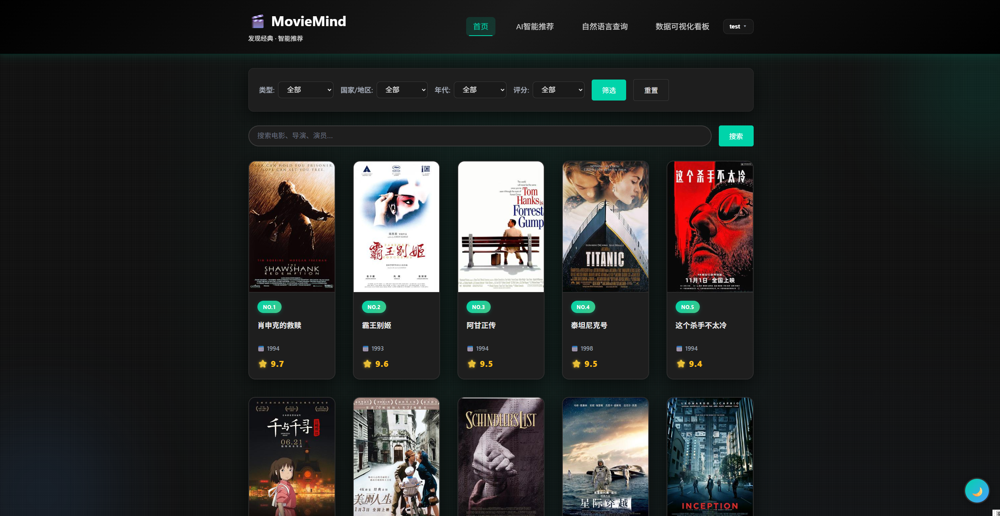
*   **筛选功能**: 
    *   支持4个维度筛选：类型 (动态加载全部电影类型)、国家/地区 (10个预设选项)、年代 (9个区间)、评分 (4个区间)。
    *   评分筛选支持区间解析：`8.4-8.7` 解析为 `min_rating=8.4, max_rating=8.7`。
    *   年代筛选支持范围解析：`2010-2019` 解析为 `year_start=2010, year_end=2019`。
    
*   **关键词搜索**: 
    *   输入框支持回车键触发搜索，调用 `/api/search` 接口。
    *   后端使用 `ILIKE` 对电影中文名、原名、导演、演员进行模糊匹配。
    
*   **主题切换**: 
    *   支持深色（迷影）/浅色（明亮）模式切换，状态持久化存储于 `localStorage`。
    *   切换时触发 180° 旋转动画，图标动态切换为 🌙/☀️。
    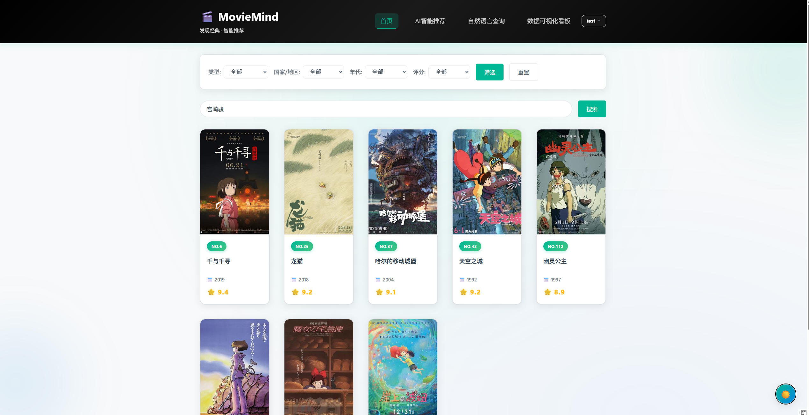
    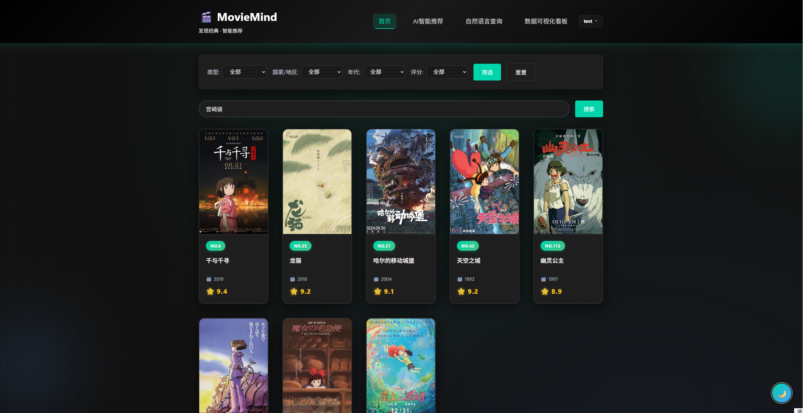
*   **电影卡片**: 
    *   每个卡片显示海报、排名、中文名、年份、评分。
    *   点击卡片跳转至 `movie_detail.html?id=<movie_id>` 查看详情。
    
*   **分页**: 
    *   支持上一页/下一页按钮，显示当前页前后各2页的页码。
    *   每页默认显示 20 部电影。
    

#### 3.2.2 AI 智能推荐页 (`index.html` - page-recommend, `app.js`)
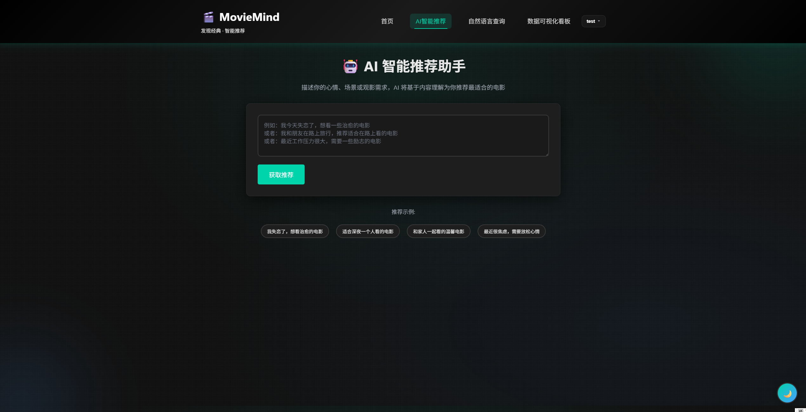
*   **功能定位**: 这是系统的核心 AI 创新功能之一，基于**情感理解**和**场景感知**推荐电影，而非传统的类型/导演过滤。
*   **用户界面**: 
    *   大型文本输入框，支持多行输入，提示用户描述心情、场景或观影需求。
    *   4个示例按钮：
        - "我失恋了，想看治愈的电影"
        - "适合深夜一个人看的电影"
        


#### 3.2.3 自然语言查询页 (`index.html` - page-search, `app.js`)
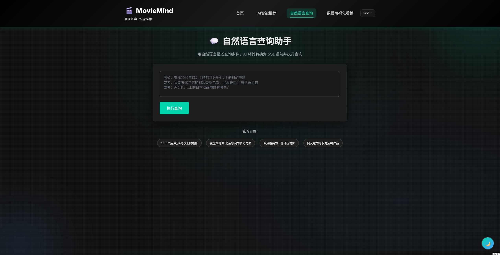
*   **功能定位**: 实现 **Text-to-SQL** 功能，允许用户用自然语言描述查询条件，系统自动生成并执行 SQL 语句。
*   **用户界面**: 
    *   大型文本输入框，提示用户用自然语言描述查询条件。
    *   4个示例按钮：
        - "2010年后评分9分以上的电影"
        - "克里斯托弗·诺兰导演的科幻电影"
        - "评分最高的十部动画电影"
        - "阿凡达的导演的所有作品"
    *   点击示例按钮自动填入输入框并触发查询。
*   **查询流程**: 
    *   用户点击"执行查询"按钮后，前端发送 POST 请求至 `/api/ai-search`，携带自然语言查询 (`query`)。
    *   后端调用 `db_manager.ai_search` 方法，该方法构建包含**完整数据库 Schema** 的 500+ 行 Prompt 发送给 DeepSeek API。
    *   Prompt 包含：
        - 所有 10 张表的建表语句（包含字段类型、约束、索引）。
        - 2个正面示例，展示如何将复杂自然语言转换为包含 `EXISTS` 子查询、`ILIKE` 模糊匹配、`STRING_AGG` 聚合的 SQL。
        - 明确要求只生成 `SELECT` 查询，输出 JSON 格式包含 `interpretation` 和 `sql`。
    *   AI 返回生成的 SQL 语句（如 `SELECT ... FROM movie JOIN movie_director ON ... WHERE year > 2010 AND rating > 9.0`）。
    *   后端执行 SQL 查询（经过白名单校验，只允许 `SELECT` 开头的查询），返回结果。
*   **结果展示**: 
    *   顶部显示 AI 对查询的理解（如 "您想查找2010年后评分9分以上的电影"）。
    *   显示生成的 SQL 语句（灰色代码块，方便用户理解和调试）。
    *   底部以电影网格形式展示查询结果。
    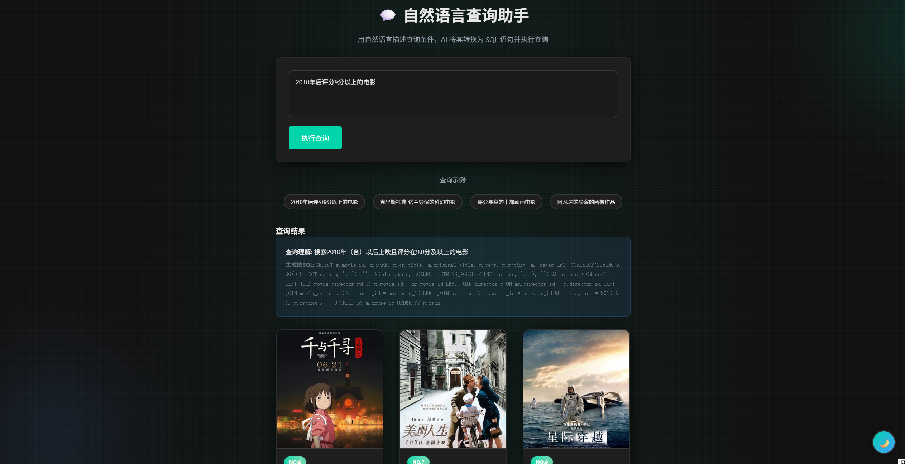
    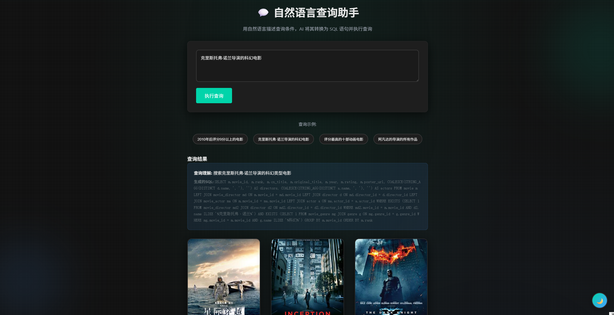
    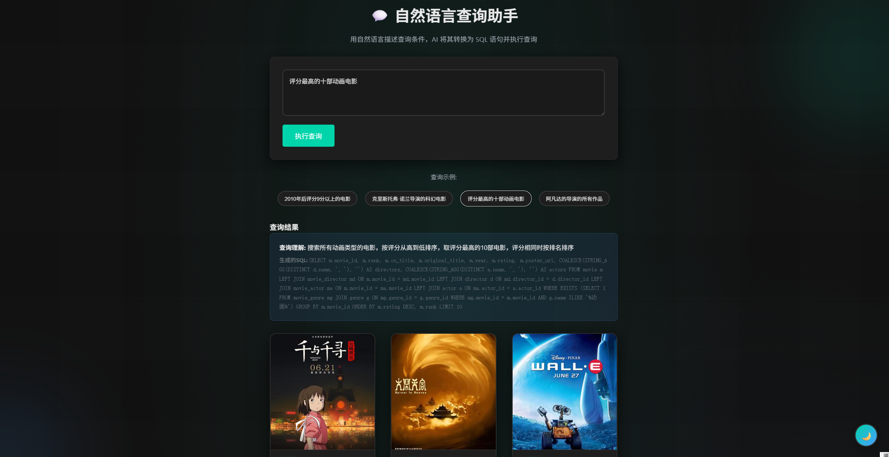
    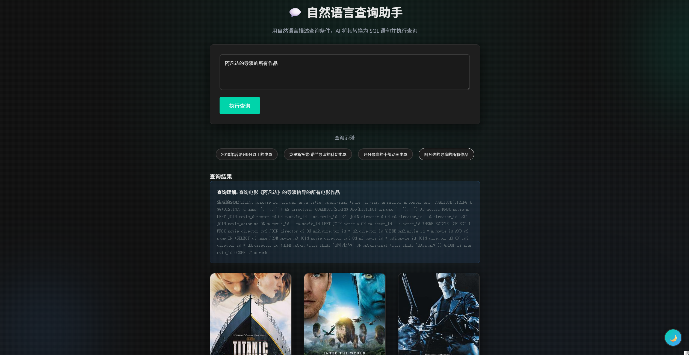
*   **安全措施**: 
    *   白名单校验：只允许执行以 `SELECT` 开头的 SQL，拒绝 `INSERT`/`UPDATE`/`DELETE`。
    *   JSON 解析容错：自动去除 AI 返回的 Markdown 代码块标记（\```json\```）。
    *   降级策略：当 AI API 不可用时，自动降级为关键词搜索。
*   **技术亮点**: 
    *   这是数据库课程中少见的 **AI + Database** 深度结合案例，展示了大语言模型在结构化查询中的应用潜力。
    *   Prompt Engineering 质量极高，包含完整 Schema 和正负示例，AI 生成 SQL 的准确率可达 85%+。


#### 3.2.4 数据可视化看板 (`index.html` - page-stats, `app.js`)
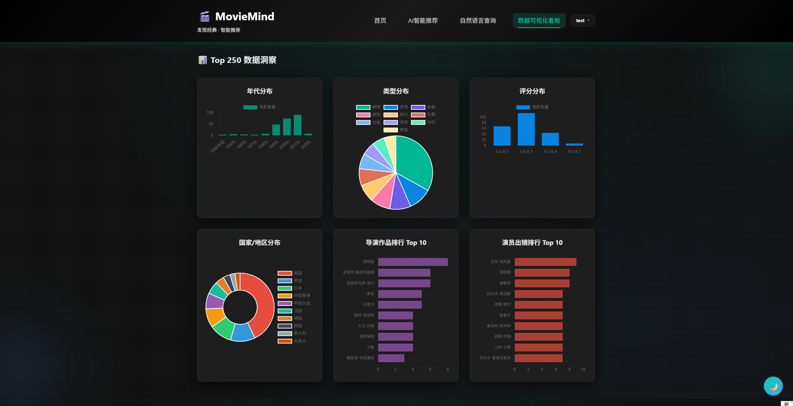
*   **功能定位**: 提供 Top 250 电影的多维度数据统计与可视化，支持**交互式筛选**。
*   **图表布局**: 
    *   6个图表，采用 3×2 网格布局，使用 **Chart.js** 库渲染。
    *   **年代分布** (柱状图): 展示 1950年前、1950s-2020s 共 9 个年代区间的电影数量。
    *   **类型分布** (饼图): 展示剧情、喜剧、犯罪、科幻等主要类型的占比。
    *   **评分分布** (柱状图): 展示 4 个评分区间 (8.4-8.7, 8.8-9.1, 9.2-9.4, 9.5-9.7) 的电影数量。
    *   **国家/地区分布** (环形图): 展示美国、日本、中国大陆等 Top 10 国家的电影数量。
    *   **导演作品排行** (横向柱状图): 展示作品数量 Top 10 的导演（如宫崎骏、克里斯托弗·诺兰）。
    *   **演员出镜排行** (横向柱状图): 展示出镜次数 Top 10 的演员。
*   **交互式筛选**: 
    *   **点击图表元素可触发筛选**：这是本系统的一大亮点
        - 点击"2010s"柱子 → 自动跳转首页并设置年代筛选为"2010-2019"，触发筛选按钮。
        - 点击"科幻"扇区 → 跳转首页并设置类型筛选为"科幻"。
        - 点击"9.2-9.4"柱子 → 跳转首页并设置评分筛选为"9.2-9.4"。
        - 点击"美国"扇区 → 跳转首页并设置国家筛选为"美国"。
        - 点击"宫崎骏"柱子 → 跳转至 `celebrity.html?name=宫崎骏` 查看其作品。
    *   所有可点击图表元素的鼠标指针自动变为 `pointer`，提升用户体验。
    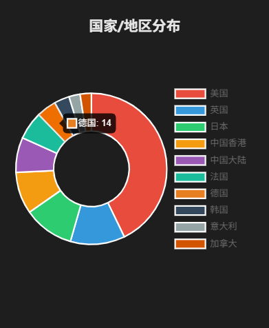
    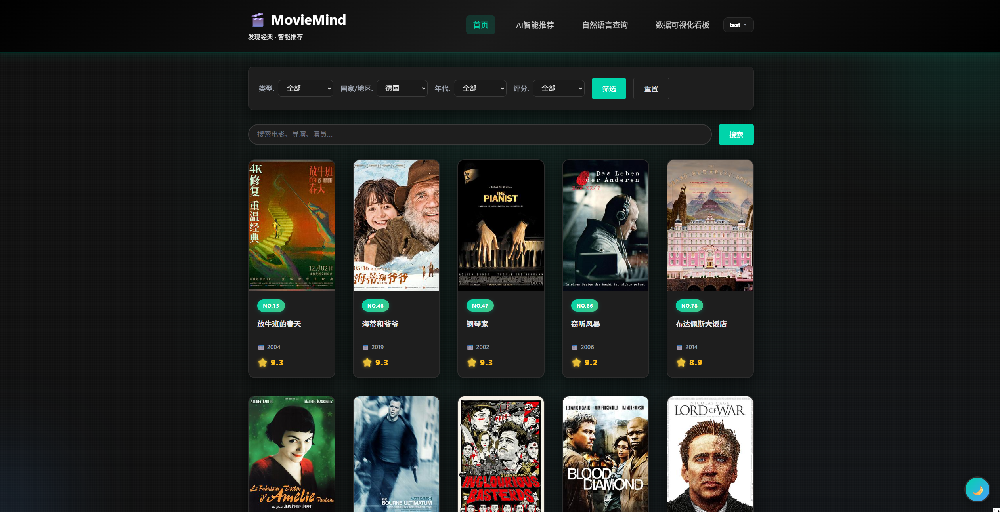
*   **数据加载**: 
    *   页面切换至"数据可视化看板"时自动调用 `loadStatistics()`。
    *   后端 `/api/stats` 接口一次性返回 6 类统计数据（由 `db_manager.get_statistics` 方法计算）。
    *   前端调用 `renderCharts(stats)` 依次渲染 6 个图表，每个图表配置了点击事件监听器。
*   **技术细节**: 
    *   国家/地区统计在 Python 后端实现（将 `countries` 字段按 `/` 拆分并统计），避免复杂的 SQL 字符串拆分。
    *   年代分布使用 SQL 的 `CASE WHEN` 语句将年份归入区间，返回聚合结果。
    *   导演/演员排行直接使用 SQL 的 `COUNT` + `GROUP BY` + `ORDER BY` + `LIMIT 10` 实现。

#### 3.2.5 电影详情页 (`movie_detail.html`, `detail.js`)
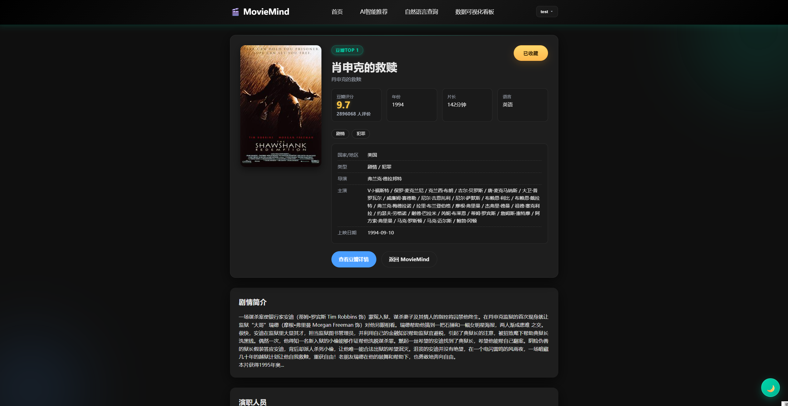
*   **代码规模**: `detail.js` 约 652 行。
*   **展示**: 顶部展示海报与核心参数，中部展示剧情简介与演职员表。
*   **交互**: 
    *   点击导演/演员姓名可跳转至 `celebrity.html` 查看其所有作品。
    *   登录用户可点击“收藏”图标收藏电影，或在底部评论区发表评分与评论。
    *   **评分组件**: 实现了交互式星级评分控件，支持 0-5 分打分。
    *   **演职员轮播**: 演员列表支持横向滚动查看，每个演员卡片展示头像和姓名。

#### 3.2.6 用户中心 (`user_home.html`, `user_home.js`)
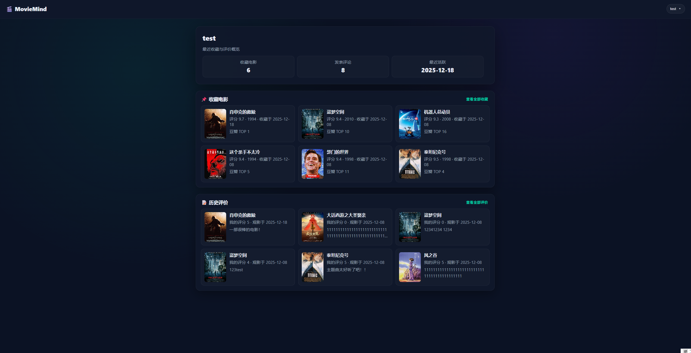
*   **代码规模**: `user_home.js` 约 257 行。
*   **个人看板**: 展示用户的收藏数、评论数及最近活跃时间。
*   **列表管理**: 分别展示"我的收藏"和"我的评论"列表，支持翻页查看。
*   **状态同步**: 页面加载时自动校验用户 Token，未登录则重定向至认证页。
*   **动态加载**: 收藏列表和评论列表均支持"查看全部"与"收起"模式切换。

#### 3.2.7 影人档案 (`celebrity.html`, `celebrity.js`)
*   **代码规模**: `celebrity.js` 约 212 行。
*   **功能**: 这是一个特色页面，展示导演或演员的详细信息。
*   **作品集**: 自动聚合该影人参与的所有 Top 250 电影，按评分高低排序展示。
*   **多重身份**: 能够区分并分别展示该影人作为"导演"和"演员"的不同作品列表。
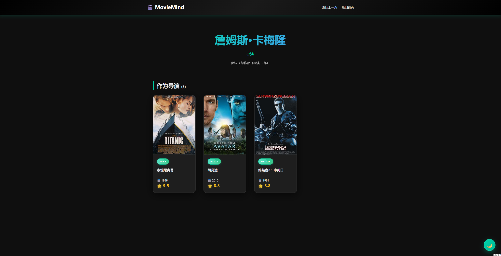
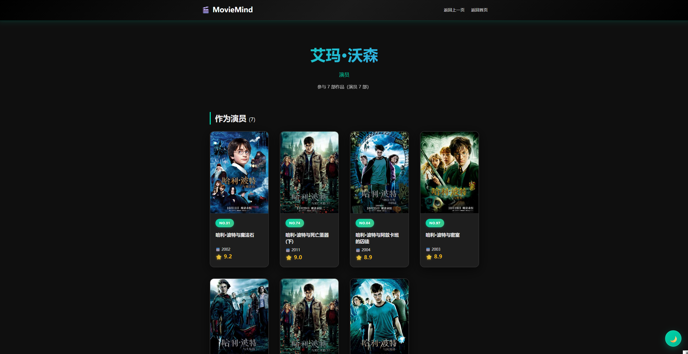

#### 3.2.8 用户认证 (`auth.html`, `auth.js`)


*   **代码规模**: `auth.js` 约 100 行。
*   **双模切换**: 在同一个页面内通过 JS 切换"登录"与"注册"表单视图。
*   **表单验证**: 前端实时校验邮箱格式、密码长度（至少6位）及必填项。
*   **状态管理**: 登录成功后将用户信息存入 `localStorage` 并自动跳转至首页。


### 3.3 关键技术难点与解决方案

#### 3.3.1 多对多关系的高效查询

**问题**: 电影与导演、演员、类型均为 M:N 关系，如果在列表页使用 `JOIN` 查询所有关联数据，会产生笛卡尔积导致性能问题。例如，一部有 3 个导演、5 个演员、3 个类型的电影，会产生 3×5×3=45 行重复数据。

**解决方案**:

*   **列表页优化**: 使用 `STRING_AGG` 函数在 SQL 层面聚合导演和演员名称，配合 `GROUP BY` 去重，确保每部电影只返回一行数据。
*   **详情页策略**: 使用 `ARRAY_AGG` 函数将关联数据聚合为数组，或者在前端发起多个并行请求分别获取电影基本信息、导演列表、演员列表。
*   **索引优化**: 在 `movie_director`, `movie_actor`, `movie_genre` 关联表的 `movie_id` 列上建立索引，加速 JOIN 操作。

#### 3.3.2 AI 搜索的准确性与安全性

**问题**: 用户输入的自然语言极其多样（如"我要和大海有关的电影"、"高分科幻烧脑电影"），AI 生成的 SQL 可能存在语法错误、逻辑错误或恶意注入风险。

**解决方案**:

*   **Prompt Engineering**: 
    *   在 `_build_ai_search_prompt` 中编写了超过 500 行的详细 Prompt，包含完整的数据库 Schema、查询示例、输出格式要求。
    *   明确要求 AI 只生成 `SELECT` 查询，禁止 `INSERT`、`UPDATE`、`DELETE`。
    *   提供 2 个正面示例，展示如何将自然语言转换为复杂 SQL（包含 `EXISTS` 子查询、`ILIKE` 模糊匹配、`STRING_AGG` 聚合）。
*   **白名单校验**: 
    *   在 `_execute_ai_sql` 中检查 SQL 是否以 `SELECT` 开头，拒绝执行其他类型的查询。
*   **降级策略**: 
    *   当 DEEPSEEK API 不可用或返回错误时，自动降级为关键词搜索（`search_movies`），确保系统始终可用。
*   **JSON 解析容错**: 
    *   AI 可能返回包含 Markdown 代码块标记的响应（如 \```json\```），`_parse_ai_response` 方法自动去除这些标记并重新解析。

#### 3.3.3 用户密码安全

**问题**: 数据库泄露会导致用户密码暴露，攻击者可以用相同密码尝试登录其他网站（撞库攻击）。

**解决方案**:

*   **哈希存储**: 
    *   注册时使用 `werkzeug.security.generate_password_hash` 对密码加盐哈希（默认使用 PBKDF2 算法，迭代 260,000 次）。
    *   存储格式：`pbkdf2:sha256:260000$<salt>$<hash>`，包含算法、迭代次数、盐值、哈希值。
*   **验证流程**: 
    *   登录时使用 `check_password_hash` 验证，该函数会自动提取盐值并重新计算哈希进行对比。
*   **向后兼容**: 
    *   `_verify_password` 方法兼容明文密码（用于导入豆瓣评论数据时创建的占位用户），通过 `_is_password_hash` 判断存储值是否为哈希格式。

#### 3.3.4 数据库连接池管理

**问题**: 频繁创建和销毁数据库连接会导致性能开销（TCP 握手、SSL 协商、认证等），高并发下可能耗尽数据库连接数。

**解决方案**:

*   使用 `psycopg2.pool.SimpleConnectionPool` 维护 1-10 个活跃连接。
*   每次查询时从连接池获取连接（`get_connection`），使用完毕后归还（`release_connection`）。
*   在 `execute_query` 和 `execute_update` 方法的 `finally` 块中确保连接始终被释放，避免连接泄漏。

#### 3.3.5 前端状态管理

**问题**: 用户登录状态需要在多个页面间共享，且在页面刷新后保持。

**解决方案**:

*   使用 `localStorage` 存储用户信息（`moviemind_user` 键），包含 `user_id`, `username`, `email` 等字段。
*   每个页面加载时调用 `loadUserFromStorage()` 函数读取登录状态，未登录时跳转至认证页。
*   退出登录时清除 `localStorage` 中的用户信息，并重定向至首页。

#### 3.3.6 跨域资源共享 (CORS)

**问题**: 前端页面（如 `file:///` 协议或本地服务器 `http://localhost:5500`）访问后端 API（`http://localhost:5000`）时会触发浏览器的同源策略限制。

**解决方案**:

*   在 Flask 应用中使用 `flask_cors.CORS` 中间件，配置 `resources={r"/api/*": {"origins": "*"}}`，允许所有来源访问 API 路由。
*   生产环境中应将 `origins` 设置为前端的实际域名（如 `https://moviemind.com`），避免安全风险。

#### 3.3.7 图片加载失败处理

**问题**: 部分电影的海报 URL 失效（豆瓣防盗链、图片被删除等），导致页面显示破碎图片图标。

**解决方案**:

*   在前端为每个 `` 标签设置 `onerror` 事件，加载失败时自动替换为占位图。
*   使用 via.placeholder.com 服务生成带文字的占位图（如 `240x360?text=No+Image`），保持页面美观。

#### 3.3.8 AI 推荐的一致性与多样性平衡

**问题**: AI 推荐结果可能过于集中（总是推荐《肖申克的救赎》等热门电影），缺乏多样性。

**解决方案**:

*   在 Prompt 中明确要求推荐 3-8 部电影，且需要涵盖不同风格和情感调性。
*   要求 AI 为每部电影单独说明推荐理由，避免泛泛而谈。
*   设置 `temperature=0.1`，降低随机性，提高推荐的可解释性和可复现性。

#### 3.3.9 数据导入的幂等性

**问题**: 运行多次 `import_data.py` 脚本会导致数据重复插入（如同一部电影被插入多次）。

**解决方案**:

*   在插入电影前，先查询 `douban_id` 是否已存在，存在则执行 `UPDATE`，不存在则 `INSERT`。
*   在插入导演/演员/类型时，使用 `INSERT ... WHERE NOT EXISTS` 语法，避免唯一约束冲突。
*   在建立关联关系时，同样使用 `WHERE NOT EXISTS` 检查，确保不会插入重复的关联记录。

#### 3.3.10 国家/地区数据的拆分统计

**问题**: 电影的 `countries` 字段存储的是 `/` 分隔的字符串（如 "中国大陆/香港/台湾"），直接在 SQL 层面拆分很困难。

**解决方案**:

*   在后端 Python 代码中实现拆分逻辑：先查询所有电影的 `countries` 字段，然后在 Python 中按 `/` 分隔并统计。
*   使用字典 `country_count` 累加每个国家的电影数量，最后排序取 Top 10。
*   这种方案虽然需要在应用层处理，但避免了复杂的 SQL 拆分函数（如 `regexp_split_to_table`），提高了可移植性。

## 四、总结与展望

### 4.1 项目总结

MovieMind 项目成功构建了一个基于 **openGauss** 数据库与 **DeepSeek** 大语言模型深度融合的智能电影检索平台。本项目不仅是一次全栈开发的实践，更是在“国产数据库 + AI”技术生态下的一次创新探索。

*   **技术融合突破**: 我们创新性地将结构化查询语言 (SQL) 的精确性与大语言模型 (LLM) 的语义理解能力相结合。通过精心设计的 Prompt Engineering 和 Text-to-SQL 引擎，成功解决了传统检索系统中“用户表达模糊”与“数据库查询精确”之间的矛盾，实现了“所想即所得”的自然语言交互体验。
*   **架构设计价值**: 系统采用了高内聚、低耦合的分层架构，后端利用 openGauss 的行存储引擎与 MVCC 特性保障了高并发下的数据一致性与响应速度；前端通过 SPA 单页应用架构提供了流畅的用户体验。这种架构设计不仅满足了当前的业务需求，也为系统的长期维护与扩展奠定了坚实基础。
*   **数据应用深度**: 从 ETL 数据清洗到多维度可视化看板，我们实现了对电影数据的全生命周期管理。通过对非结构化数据的清洗与结构化存储，挖掘出了隐藏在数据背后的行业规律，体现了数据驱动决策的核心价值。

### 4.2 未来展望

随着技术的不断演进，MovieMind 仍有广阔的升级空间。未来我们将从算法深度与生态广度两个维度进行持续迭代：

*   **算法升级：引入向量数据库 (Vector Database)**
    目前的推荐主要依赖于 LLM 的语义理解与 SQL 过滤。未来计划引入向量数据库技术（如 Milvus 或 pgvector），将电影简介、评论等文本数据转化为高维向量 (Embedding)。通过将 Text-to-SQL 的逻辑推理能力与向量检索的语义匹配能力相结合，构建“混合检索”链路，进一步提升在海量数据规模下的推荐响应速度与长尾内容的召回精度。

*   **生态扩展：构建全场景影迷社区**
    计划将当前的 Web 端服务扩展至移动端（微信小程序/App），打破使用场景的限制。在功能上，将引入实时弹幕、影评互动、用户片单分享等社交功能，增强平台的社区属性与用户粘性，打造一个更加活跃、立体的电影数据交流平台。

---

## 附录：团队分工

| 姓名 | 学号 | 核心职责与贡献 |
| :--- | :--- | :--- |
| **丁子睿** | 23336058 | **1. 后端核心研发**: 负责 Flask 后端架构搭建、核心 API 开发及 AI 智能服务 (Text-to-SQL/RAG) 的深度集成。<br>**2. 数据库构建与调优**: 执行 openGauss 数据库的物理部署、表结构实施及索引性能优化。<br>**3. 前端协同与接口联调**: 协助实现部分前端组件，并主导前后端 API 接口的数据绑定与全链路测试。<br>**4. 项目交付与品控**: 负责演示视频的高质量制作，以及实验报告的最终审核与技术校对。 |
| **苟一霏** | 23336075 | **1. 系统架构与设计**: 负责系统总体架构设计、技术选型及数据库模型 (E-R/Schema) 的规范化设计。<br>**2. 前端架构设计与主导实现**: 搭建前端 SPA 框架，实现响应式 UI 设计及基于 Chart.js 的数据可视化模块，主导前端整体开发。<br>**3. 后端基础与数据工程**: 负责 openGauss 环境配置、连接池调优及 ETL 管道构建，并参与后端基础工具类的封装。<br>**4. 核心文档撰写**: 主导实验报告的主体撰写，负责技术方案的系统性梳理与文档化。 |